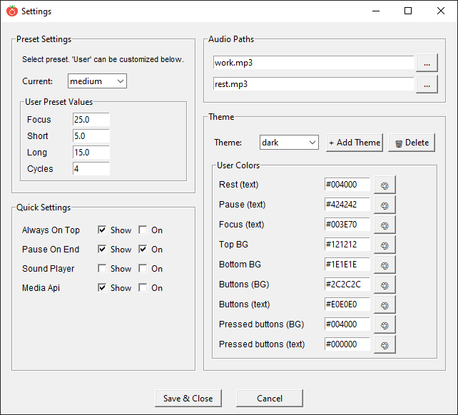

# <p align="center">Простой таймер Pomodoro, написанный на Python с использованием Tkinter</p>


English [README](README.md).

## Обзор

Простой таймер Pomodoro. Таймер структурирует интервалы работы и отдыха, используя метод Pomodoro для повышения фокуса и предотвращения выгорания. Гибкие настройки для интервалов, тем, звуков и системных опций.

## Возможности

* **Таймер с фазами:** Фокус (Работа), короткий отдых, длинный отдых, пауза.
* **Циклы:** Автоматический подсчет сессий до длинного отдыха.
* **Ручное управление:** Переключение фаз вперед/назад, сброс, пауза.
* **Интерфейс:**
    * Главное окно с крупным отображением времени, текущей фазы и цикла.
    * Модальное окно настроек для детальной конфигурации.
    * Поддержка светлой, темной и пользовательских тем (цвета фона, кнопок и текста).
    * Сохранение и восстановление размера и положения окна.
* **Настройки:**
    * Пресеты таймера: Small, Medium, Large и полностью пользовательские значения (минуты для каждой фазы и количество циклов до длинного отдыха).
    * Выбираемые звуковые файлы для начала фаз работы и отдыха (поддерживаются MP3 и другие форматы, воспроизводимые `pygame`).
    * Опция "Always on top" (Поверх всех окон).
    * Управление системным медиаплеером через библиотеку `keyboard`. Отправляет события медиа-клавиш Play/Pause в ОС, чтобы большинство приложений, поддерживающих медиа (браузеры, музыкальные/видеоплееры), реагировали.
    * Возможность полного отключения звука.
    * Быстрые действия: Переключение некоторых настроек прямо с главного экрана.
    * Автосохранение: Все изменения сохраняются в `settings.json` и восстанавливаются при следующем запуске.

## Как установить и запустить

### Исполняемый файл для Windows

1. Скачайте .exe из [releases](https://github.com/ChillLich/pomodoro-timer/releases).
2. Приятного использования!

### Автоматическая установка

1. Установите `python3` через официальный сайт (я тестировал на `3.11.9`, ссылка на эту версию):

    ```https://www.python.org/downloads/release/python-3119/```
2. Скачайте репозиторий (например, как ZIP-архив и распакуйте его, или клонируйте через Git).

    ```bash
    git clone https://github.com/ChillLich/pomodoro-timer.git
    ```

3. Перейдите в папку проекта.
4. Запустите `main.py` двойным кликом или через `cmd`/`bash`:

    * На Windows:
  
        ```cmd
        py -3.11 main.py
        ```

    * На Linux/Mac:

        ```bash
        python3.11 main.py
        ```

5. При первом запуске скрипта `main.py` он автоматически создаст виртуальное окружение с именем 'venv' в папке проекта и установит все необходимые зависимости (Pygame, keyboard).
6. Последующие запуски будут использовать существующее окружение.

> **Примечание:** Управление системным медиаплеером (функция "Manage System Media") может требовать прав администратора (на Linux) или соответствующих разрешений на macOS.

### Ручная установка

1. Убедитесь, что установлен Python 3.8 или новее. Тестировалось на версии 3.11.
    Клонируйте репозиторий:

    ```bash
    git clone https://github.com/ChillLich/pomodoro-timer.git
    cd pomodoro-timer
    ```

2. (Рекомендуется) Создайте и активируйте виртуальное окружение:

    ```bash
    python -m venv venv
    source venv/bin/activate # Linux/macOS
    venv\Scripts\activate # Windows
    ```

3. Установите зависимости:

    ```bash
    pip install -r requirements.txt
    ```

4. Запустите приложение:

    ```bash
    python gui.py
    ```

## ⚙️ Конфигурация

Все настройки хранятся в файле `settings.json` (создается автоматически при первом запуске).

* **Рекомендуемый метод:** Изменение настроек через встроенный графический интерфейс (кнопка `⚙ Settings`).
* **Ручное редактирование:** Не рекомендуется. Файл имеет сложную вложенную структуру, и ошибка в синтаксисе JSON может привести к сбросу настроек или ошибкам запуска.

* Полностью настраиваемый, скриншот настроек:


## Решение проблем

### Приложение не запускается

Запустите `main.py` из терминала или командной строки — вы увидите подробный вывод ошибки. Наиболее частая проблема — отсутствующие зависимости или неверный путь к аудиофайлам. Поэтому попробуйте удалить папку `venv`, чтобы создать новое окружение.

### Управление медиаплеером не работает

Эта функция использует библиотеку `keyboard`, которая может требовать прав администратора. Попробуйте запустить приложение от имени администратора (Windows) или с sudo (Linux). На macOS могут потребоваться дополнительные разрешения в настройках безопасности.

### Звуки не воспроизводятся

Проверьте, что пути к файлам в настройках указаны верно и файлы существуют. Также убедитесь, что `pygame` установлен в виртуальном окружении или в системе и может воспроизводить выбранный формат (MP3, WAV и многие другие поддерживаются `pygame`). Убедитесь, что файлы `work.mp3` и `rest.mp3` находятся в папке программы или укажите полные пути к ним в настройках.

### Настройки не сохраняются

Проверьте права на запись для папки приложения. Файл `settings.json` должен создаваться автоматически.

### Что-то сломалось в настройках или приложение падает с ошибкой

1. Сначала закройте приложение (это важно).
2. Затем удалите файл `settings.json`.

Если вы нашли баг или у вас есть предложение, не стесняйтесь создать issue на GitHub.
