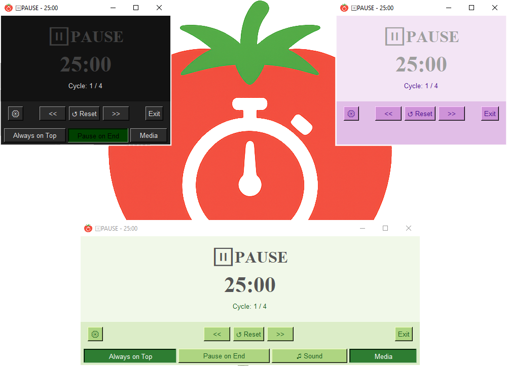

# <p align="center">Simple Pomodoro timer written on Python with Tkinter.</p>


## Overview

Simple Pomodoro timer. The timer structures work and break intervals using the Pomodoro method to boost focus and prevent burnout. Flexible settings for intervals, themes, sounds, and system options.

## Features

- **Timer with phases:** Focus (Work), short rest, long rest, pause.
- **Cycles:** Automatic counting of sessions until a long rest.
- **Manual control:** Forward/backward phase switching, reset, pause.
- **Interface:**
- Main window with a large display of the time, current phase, and cycle.
- Modal settings window for detailed configuration.
- Support for light, dark, and custom themes (background, button, and text colors).
- Save and restore window size and position.
- **Settings:**
- Timer presets: Small, Medium, Large, and fully custom values ​​(minutes for each phase and number of cycles until a long rest).
- Selectable sound files for the start of work and rest phases (MP3 and other formats played by `pygame` are supported).
- "Always on top" option.
- Controlling the system media player via the `keyboard` library. Sends Play/Pause media-key events to the OS so most media-capable applications (browsers, music/video players) respond.
- Ability to completely mute the sound.
- **Quick actions:** Toggle some settings directly from the home screen.
- **Autosave:** All changes are saved to `settings.json` and restored on next launch.
- **Clean shutdown:** When the app closes, the sound stops and the state is saved.

## How to install and run

### Automatic Installation:

1. Install `python3` via official, as I tested on `3.11.9` link to this version:

```curl
https://www.python.org/downloads/release/python-3119/
```

2. Download the repository (for example, as a ZIP archive and unzip it, or clone it via Git).

```bash
git clone https://github.com/ChillLich/pomodoro-timer.git
```

3. Navigate to the project folder.

4. Run `main.py` by double click or run via `cmd`/`bash`:

On Windows:

```cmd
py -3.11 main.py
```

On Linux/Mac:

```bash
python3.11 main.py
```

The first time you run the script `main.py`, it will automatically create a virtual environment named 'venv' in the project folder and install all necessary dependencies (Pygame, keyboard).
Subsequent runs will use the existing environment.

**Note:** The system media player controls (the "Manage System Media" feature) may require administrator privileges (on Linux) or the appropriate permissions on macOS.

### Manual Installation:

1. Make sure Python 3.8 or later is installed. Tested with version 3.11.
2. Clone the repository:

```bash
git clone https://github.com/ChillLich/pomodoro-timer.git
cd pomodoro-timer
```

3. (Recommended) Create and activate the virtual environment:

```bash
python -m venv venv
source venv/bin/activate # Linux/macOS
venv\Scripts\activate # Windows
```

4. Install dependencies:

```bash
pip install -r requirements.txt
```

5. Run the application:

```bash
python gui.py
```

## ⚙️ Configuration

All settings are stored in the `settings.json` file (created automatically on first launch).

- **Recommended method:** Changing settings through the built-in GUI (`⚙ Settings` button).
- **Manual editing:** Not recommended. The file has a complex nested structure, and an error in the JSON syntax may result in resetting settings or startup errors.

## Troubleshooting

The application won't start
Run main.py from the terminal or command line—you'll see a detailed error output. The most common issue is missing dependencies or an incorrect path to the audio files. Therefore try to delete `venv` folder to create new environment.

Media player controls aren't working
This feature uses the `keyboard` library, which may require administrator privileges. Try running the application as an administrator (Windows) or with sudo (Linux). On macOS, you may need additional permissions in the security settings.

Sounds aren't playing
Check that the file paths in the settings are correct and that the files exist. Also, make sure pygame is installed in virtual environment or on your system and can play the selected format (MP3, WAV, and many others are supported by pygame). Make sure that the work.mp3 and rest.mp3 files are located in the program folder or specify the full paths to them in the settings.

Settings aren't saving
Check write permissions for the application folder. The `settings.json` file should be created automatically.

Something broken with settings or app crashes with an error
First, close the app (this is important), then delete the `settings.json` file.

If you find a bug or have a suggestion, feel free to write an issue on GitHub.
